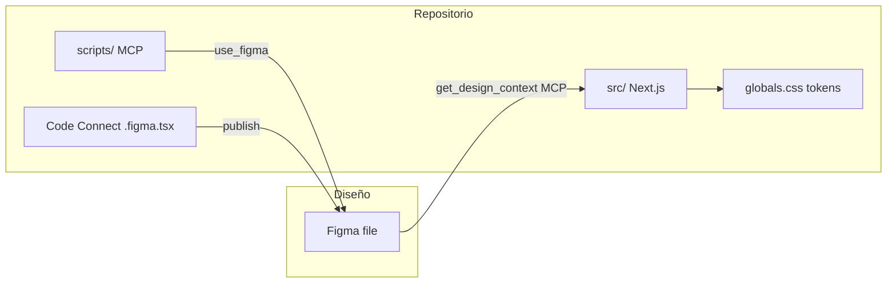

# Rightboat — prototipo y Figma como fuente de UI

Este repositorio (`rightboat-prototype`) es el **prototipo Next.js** del marketplace náutico. El diseño en **Figma** y el código aquí deben mantenerse alineados: este documento es la referencia humana para el flujo, enlaces y trazabilidad.

## Archivo de diseño en Figma

| Dato | Valor |
|------|--------|
| **URL del archivo (design system)** | [El-Captain-DS](https://www.figma.com/design/VOCH4pGubqSYza7CbL30c7/) |
| **`fileKey` DS (API / MCP / scripts)** | `VOCH4pGubqSYza7CbL30c7` |
| **URL del archivo (FSBO flow)** | [FSBO-Page](https://www.figma.com/design/1JdEElYI3kToAhnJwXedF0/FSBO-Page) |
| **`fileKey` FSBO (Code Connect pantallas)** | `1JdEElYI3kToAhnJwXedF0` |

Si el archivo se duplica, se mueve o se usa una **rama** de equipo, actualiza esta tabla y los scripts que incrustan el `fileKey` (por ejemplo [`scripts/figma-boat-card-component.js`](../scripts/figma-boat-card-component.js)).

**Enlaces con contexto:** al compartir un cambio concreto, usa siempre **Copiar enlace a la selección** en Figma; la URL incluye `node-id=…` (en la API, sustituye `-` por `:` en el id del nodo).

## Fuentes de verdad y flujo bidireccional

1. **Tokens y semántica de UI**  
   - Código: [`src/app/globals.css`](../src/app/globals.css) (`:root`, `.dark`, `@theme inline`) y, cuando aplique, [`src/styles/tokens.ts`](../src/styles/tokens.ts).  
   - Detalle de convenciones: [`DESIGN_SYSTEM.md`](../DESIGN_SYSTEM.md).

2. **Figma → código (implementación)**  
   - Implementar pantallas y componentes siguiendo el diseño en Figma.  
   - Con **Cursor + Figma MCP**, el flujo operativo para el agente está en [`.cursor/rules/figma-design-system.mdc`](../.cursor/rules/figma-design-system.mdc) (contexto de diseño, screenshot, tokens, carpetas `ui` / `patterns`).

3. **Código / MCP → Figma (sincronización estructurada)**  
   - Scripts bajo [`scripts/`](../scripts/) que ejecutan la Plugin API vía MCP (`use_figma`), por ejemplo la regeneración del componente **Boat Card**.  
   - Payload auxiliar: [`.figma-payload.json`](../.figma-payload.json) (contenido generado a partir del script; ver comentarios en el script para regenerar `mcp-args-*.json`).

4. **Dev Mode ↔ código (Code Connect)**  
   - Configuración y publicación: [`docs/CODE_CONNECT.md`](./CODE_CONNECT.md) y [`figma.config.json`](../figma.config.json).

## Trazabilidad en el equipo

- **Pull requests** que toquen UI: enlazar el frame o componente en Figma (`node-id` en la URL). Usa la [plantilla de PR](../.github/pull_request_template.md).  
- **Commits:** cuando tenga sentido, el mismo enlace en el cuerpo del mensaje o en el PR asociado.  
- **Cambios grandes de diseño:** añade una entrada breve en [`DESIGN_SYNC.md`](../DESIGN_SYNC.md) (fecha, pantallas o componentes, enlace Figma, PR).

## Decisiones de producto (cerradas)

| Decisión | Resultado |
|----------|-----------|
| **SRP desktop layout (Q2)** | **Split view gana.** Sidebar de filtros + grid de 3 columnas es el listing live (`/boats-for-sale`), frame Figma [558-6909](https://www.figma.com/design/VOCH4pGubqSYza7CbL30c7/El-Captain-DS?node-id=558-6909). El grid de 4 columnas con drawer queda archivado en [`/archive/srp-grid`](../src/app/archive/srp-grid/page.tsx); su frame Figma (83-737) fue borrado del archivo — verificado 2026-08-30 — y la ruta del prototipo es el único artefacto. No reabrir el A/B. |

## Estructura relacionada en el repo

| Ruta | Propósito |
|------|-----------|
| `src/components/ui/` | Primitivos (Button, Card, …) |
| `src/components/patterns/` | Composición reutilizable (p. ej. `ListingCard`) |
| `.cursor/rules/figma-design-system.mdc` | Reglas para implementación con Figma MCP en Cursor |
| `skills/figma-*/SKILL.md` | Skills de Figma copiadas en el repo (referencia para agentes) |

## Requisitos de acceso

- Permisos de lectura (y edición si aplican scripts o Code Connect) al archivo Figma del equipo.  
- **Code Connect** en Figma requiere plan y permisos según la [documentación oficial de Figma](https://developers.figma.com/docs/code-connect/) (Organization / Enterprise y token con alcance adecuado para publicar).
